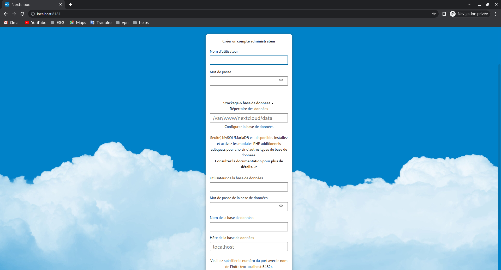
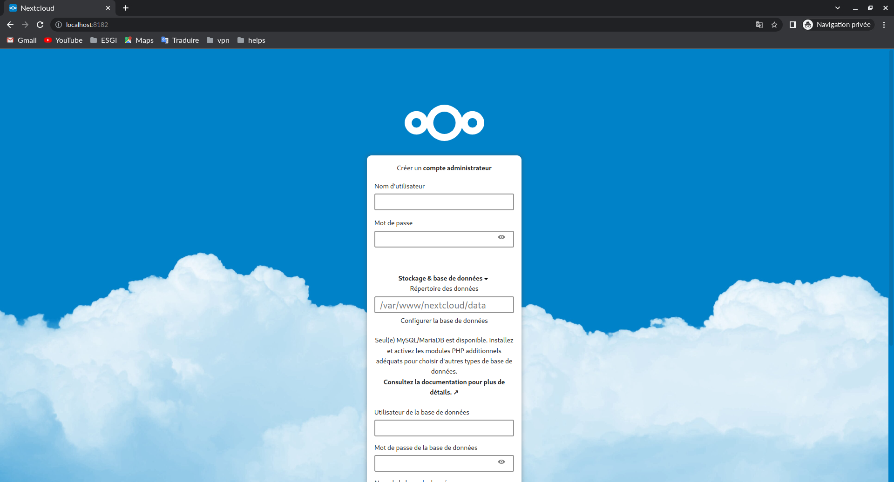

# TP I DOCKER: Création d'une image docker légère pour Nextcloud

## Etape 1: Création de l'image docker basée sur ubuntu 22.04

``` dockerfile
FROM ubuntu:22.04
LABEL maintainer=delibes.bechir.bkwedou@gmail.com

ENV DEBIAN_FRONTEND=noninteractive

RUN apt update

RUN apt install -y php8.1 php8.1-curl
RUN apt install -y php8.1-xml
RUN apt install -y php8.1-fileinfo
RUN apt install -y php8.1-mbstring
RUN apt install -y php8.1-zip
RUN apt install -y php8.1-bcmath
RUN apt install -y php8.1-mysql
RUN apt install -y php8.1-intl
RUN apt install -y php8.1-fpm
RUN apt install -y apache2
RUN a2enmod rewrite
RUN a2dissite 000-default.conf
ADD ./conf/nextcloud.conf /etc/apache2/sites-available/nextcloud.conf
RUN a2ensite nextcloud.conf
RUN a2enmod headers
RUN a2enmod env
RUN a2enmod dir
RUN a2enmod mime
WORKDIR /var/www/
RUN apt install -y wget
RUN wget https://download.nextcloud.com/server/releases/latest.zip
RUN apt install -y unzip
RUN unzip latest.zip
RUN chown www-data:www-data -R nextcloud/
RUN apt install -y php8.1-gd
CMD ["apachectl", "-D", "FOREGROUND"]
EXPOSE 80
```

## Etape 2: Test et validation

* Construction de l'image

```console
delbechir@bngameni:~$ cd tp1/

delbechir@bngameni:~$ docker build -t nextcloud:v1 .
Sending build context to Docker daemon  4.096kB
Step 1/31 : FROM ubuntu:22.04
 ---> 08d22c0ceb15
Step 2/31 : LABEL maintainer=delibes.bechir.bkwedou@gmail.com
 ---> Using cache
 ---> e78009675b93
Step 3/31 : ENV DEBIAN_FRONTEND=noninteractive
 ---> Using cache
 ---> 9091818da8df
Step 4/31 : RUN apt update
 ---> Using cache
 ---> 2c469533aed1
Step 5/31 : RUN apt install -y php8.1 php8.1-curl
 ---> Using cache
 ---> 112cf15a9bf4
Step 6/31 : RUN apt install -y php8.1-xml
 ---> Using cache
 ---> c179954c688a
Step 7/31 : RUN apt install -y php8.1-fileinfo
 ---> Using cache
 ---> 19200c8ec41e
Step 8/31 : RUN apt install -y php8.1-mbstring
 ---> Using cache
 ---> 6f1b81995050
Step 9/31 : RUN apt install -y php8.1-zip
 ---> Using cache
 ---> 785bfd80d735
Step 10/31 : RUN apt install -y php8.1-bcmath
 ---> Using cache
 ---> 2d9574596c68
Step 11/31 : RUN apt install -y php8.1-mysql
 ---> Using cache
 ---> 06ff12346d2f
Step 12/31 : RUN apt install -y php8.1-intl
 ---> Using cache
 ---> b25887ca9322
Step 13/31 : RUN apt install -y php8.1-fpm
 ---> Using cache
 ---> bc4228610936
Step 14/31 : RUN apt install -y apache2
 ---> Using cache
 ---> 471310a6fbf5
Step 15/31 : RUN a2enmod rewrite
 ---> Using cache
 ---> 5f7114abaa9e
Step 16/31 : RUN a2dissite 000-default.conf
 ---> Using cache
 ---> 957a28d6c86e
Step 17/31 : ADD ./conf/nextcloud.conf /etc/apache2/sites-available/nextcloud.conf
 ---> Using cache
 ---> 6a169eacc13c
Step 18/31 : RUN a2ensite nextcloud.conf
 ---> Using cache
 ---> 1d67af29a276
Step 19/31 : RUN a2enmod headers
 ---> Using cache
 ---> fbf9b3e78f6d
Step 20/31 : RUN a2enmod env
 ---> Using cache
 ---> 35c975f9f624
Step 21/31 : RUN a2enmod dir
 ---> Using cache
 ---> 4c3f13c747c1
Step 22/31 : RUN a2enmod mime
 ---> Using cache
 ---> e4c479fb3d94
Step 23/31 : WORKDIR /var/www/
 ---> Using cache
 ---> 2ff495323faa
Step 24/31 : RUN apt install -y wget
 ---> Using cache
 ---> 16c61ebe1370
Step 25/31 : RUN wget https://download.nextcloud.com/server/releases/latest.zip
 ---> Using cache
 ---> f74d52cc5efc
Step 26/31 : RUN apt install -y unzip
 ---> Using cache
 ---> 6a02871299c0
Step 27/31 : RUN unzip latest.zip
 ---> Using cache
 ---> 05c55e94a34c
Step 28/31 : RUN chown www-data:www-data -R nextcloud/
 ---> Using cache
 ---> 45db1b105812
Step 29/31 : RUN apt install -y php8.1-gd
 ---> Using cache
 ---> b6d48bc72f58
Step 30/31 : EXPOSE 80
 ---> Running in 8765878dd3ef
Removing intermediate container 8765878dd3ef
 ---> 0719227ea06b
Step 31/31 : CMD ["apachectl", "-D", "FOREGROUND"]
 ---> Running in 75f3ae41e019
Removing intermediate container 75f3ae41e019
 ---> 3d2b3c34c32d
Successfully built 3d2b3c34c32d
Successfully tagged nextcloud:v1

```

* Démarrage d'un conteneur docker avec l'image crée et verification de nextcloud

```console
delbechir@bngameni:~$ docker run -tid --name -p 8181:80 docker_nextcloud nextcloud:v1
ca3a6f85bb33699089e829c5a279d7906383be8f37597ccc94c76635f5419c01

delbechir@bngameni:~$ docker ps                                                       
CONTAINER ID   IMAGE          COMMAND                  CREATED         STATUS         PORTS                                   NAMES
ca3a6f85bb33   nextcloud:v1   "apachectl -D FOREGR…"   9 seconds ago   Up 8 seconds   0.0.0.0:8181->80/tcp, :::8181->80/tcp   docker_nextcloud

```



* Documentation des défis et des solutions apportées

Défis rencontrés                                                 | Solutions apportées  
|----------------------------------------------------------------|---------------------------------|
Mode non interactif lors de l'installation des paquets avec apt  | Ajout du -y à la suite des commandes d'install.Ex: apt install -y apache2 |
Mode non interaction lors de l'install de tzdata                 | Ajout de la var d'env DEBIAN_FRONTEND=noninteractive |
Accès à la page d'acceuil d'apache après l'installation          | Désactiver le fichier de configuration par défaut d'apache avec la commande: a2dissite 000-default.conf

## Etape 3: Exploration d'alternatives légères

* Recherche des images de base légère

Imgaes                  | Avantages                       | Inconvénients
|-----------------------|---------------------------------|-----------------------------------------|
alpine:latest           | Plus légère comme image, tournant autour des 4 Mo | L'installation des packages et des dépendances peut être plus complexe.  |
php:8.1                 | Elle se base sur l'alpine, du coup, on récupère de façon implicite les avantages de l'image alpine. sauf que plus besoin d'installer les dépendances à php car l'image de base contient déjà php installé et quelques dépendances      | L'image ne contient pas toutes les dépendances de php, et il faut installer apache2 et compiler quelques paquets propres à php |
debian:stable-slim      | Elle offre une environnement similaire à des débian classiques, sauf qu'avec des packages de base qui sont désinstallées. Il est d'ailleurs comme son nom l'indique plus slim que le debian de base.                                 | On observe qu'on se retrouvera avec quasiment la même taille que l'ubuntu de base, car il faudra installer un bon nombre de packages pour arriver à nextcloud fonctionnel.

## Etape 4: Création de l'image Docker basée sur une alternative légère

Des alternatives basées sur debian-slim et sur php-alpine

* Nouveau dockerfile sur debian-slim

```dockerfile
FROM debian:stable-slim
LABEL maintainer=delibes.bechir.bkwedou@gmail.com
ARG PHP_VERSION=8.1
ENV DEBIAN_FRONTEND=noninteractive TZ=Etc/UTC

RUN apt update && apt upgrade -y; \
apt install curl wget gnupg2 ca-certificates lsb-release apt-transport-https -y; \
add-apt-repository ppa:ondrej/php; \
apt update -y; \
apt install -y apache2 unzip wget; \
wget https://packages.sury.org/php/apt.gpg; \
apt-key add apt.gpg; rm apt.gpg; \
echo "deb https://packages.sury.org/php/ $(lsb_release -sc) main" > /etc/apt/sources.list.d/php7.list; \
apt update -y; \
php${PHP_VERSION} php${PHP_VERSION}-gd php${PHP_VERSION}-mysql php${PHP_VERSION}-curl php${PHP_VERSION}-mbstring php${PHP_VERSION}-intl php${PHP_VERSION}-gmp \
php-${PHP_VERSION}bcmath php${PHP_VERSION}-xml php${PHP_VERSION}-imagick php${PHP_VERSION}-zip; \
a2enmod headers; libapache2-mod-php${PHP_VERSION}; a2dissite 000-default.conf; apt-get clean; rm -rf /var/lib/apt/lists/*

WORKDIR /var/www/

RUN wget https://download.nextcloud.com/server/releases/latest.zip && \
unzip latest.zip && rm latest.zip && chown www-data:www-data -R nextcloud

ADD ./conf/nextcloud.conf /etc/apache2/sites-available/nextcloud.conf

RUN  a2enmod rewrite && a2ensite nextcloud.conf

EXPOSE 80

CMD ["apachectl", "-D", "FOREGROUND"]

# apachectl, -D, FOREGROUND
```

* Nouveau dockerfile sur php-alpine

```dockerfile
FROM php:8.1-fpm-alpine3.16

RUN set -ex; \
    \
    apk add --no-cache --virtual .build-deps \
        apache2-proxy \
        unzip \
        php8-fpm \
        autoconf \
        freetype-dev \
        gmp-dev \
        icu-dev \
        imagemagick-dev \
        libevent-dev \
        libjpeg-turbo-dev \
        libmcrypt-dev \
        libmemcached-dev \
        libpng-dev \
        libwebp-dev \
        libxml2-dev \
        libzip-dev \
        pcre-dev \
    ; \
    \
    docker-php-ext-configure gd --with-freetype --with-jpeg --with-webp; \
    docker-php-ext-install -j "$(nproc)" \
        bcmath \
        exif \
        gd \
        gmp \
        intl \
        opcache \
        pcntl \
        pdo_mysql \
        sysvsem \
        zip \
    ;

WORKDIR /var/www/

RUN set -ex; \
    rm -rf /etc/apache2/conf.d/default.conf; \
    wget https://download.nextcloud.com/server/releases/latest.zip; \
    unzip latest.zip; rm latest.zip; chown www-data:www-data -R nextcloud;

ADD conf/nextcloud.conf /etc/apache2/conf.d/nextcloud.conf

CMD httpd -k start && php-fpm
```

* Build de la nvelle image
  
```console
delbechir@bngameni:~$ docker build -t nextcloud:v2 .
```

## Etape 5: Test et Comparaison des performances

* Demarrez la nvelle image
  
```console
delbechir@bngameni:~$ docker run -tid --name docker_nextcloud_slim -p 8182:80 nextcloud:v2
884995ac6c6008d4213a07b20d5c9f8a2ff02c3a6828bfc4f1068fa2e449c828

delbechir@bngameni:~$ docker ps                                                           
CONTAINER ID   IMAGE          COMMAND                  CREATED              STATUS              PORTS                                   NAMES
884995ac6c60   nextcloud:v2   "apachectl -D FOREGR…"   About a minute ago   Up About a minute   0.0.0.0:8182->80/tcp, :::8182->80/tcp   docker_nextcloud_slim

```



* comparaison des performances

```console
delbechir@bngameni:~$ docker images | grep nextcloud
nextcloud                                            v2            8c070f8f458b   8 hours ago      682MB
nextcloud                                            v1            3d2b3c34c32d   2 hours ago      1.47GB
```

NB: la v2 charge beaucoup plus vite que la v1 et occupe moins d'espace
